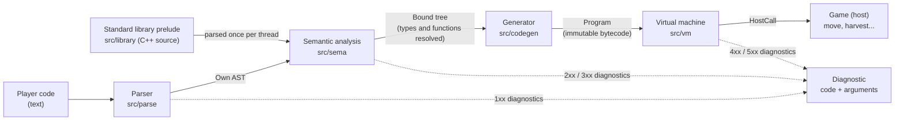

# Architecture

## Overview

`cppi` is a small compiler followed by a virtual machine. Player code goes through four stages, each with a single responsibility and its own data as the boundary:



| Stage | Input | Output | Can fail with |
|---|---|---|---|
| Parser | text | `ast::TranslationUnit` | syntax errors (1xx) |
| Analysis | AST + prelude AST + `HostRegistry` + `Options` | `sema::BoundProgram` | names, types (2xx), features (3xx) |
| Generator | bound tree | `ProgramData` (bytecode) | never: everything was validated before |
| VM | `Program` + `RunOptions` | `RunResult` | budget, host error, resource limits (4xx), undefined behavior (5xx) |

Compiling and running are separate on purpose: the game compiles once when the player presses "Run" and can run the same `Program` many times (retries, simulations, several automatons).

## Boundaries and dependencies

```
include/cppi/   ← public API: includes nothing from tree-sitter or src/
src/api/        ← implementation of the public classes (Interpreter, Execution, Program)
src/pipeline/   ← CompilerPipeline: chains parse → sema → codegen
src/support/    ← shared building blocks: HostRegistry, features, DiagnosticFactory
src/ast/        ← AST node types (plain data)
src/parse/      ← the only module that knows about tree-sitter
src/sema/       ← depends on the AST and the public API
src/library/    ← the standard library prelude, as C++ source text
src/codegen/    ← depends on the bound tree
src/vm/         ← depends on the bytecode and the public API
```

Every class lives in its own file named after it (`FeatureGate.hpp` / `FeatureGate.cpp`), and every file name starts with an uppercase letter. Small plain-data structs that only make sense together (the AST node variants, the bound tree) share one file per family.

- **tree-sitter is encapsulated.** Only `src/parse` includes it. If the parser is replaced tomorrow, nothing else changes. That is why Conan declares it with `transitive_headers=False`.
- **The public API is small and stable**: `Interpreter`, `HostRegistry`, `Program`, `Execution`, `ProgramCache`, `Diagnostic`, `Value`, `Options`/`RunOptions`, and the debugger views `StackFrame`/`Variable`.
- **The interpreter knows nothing about the game.** Not about automatons, grids, or languages.

## Patterns used (and why)

| Pattern | Where | Why |
|---|---|---|
| **Facade** | `cppi::Interpreter` | The game uses a single class for the whole pipeline. |
| **Pipeline** | `detail::CompilerPipeline` | Parse → analyze → generate, each stage with its own data as the boundary; stops at the first stage with errors. |
| **Adapter** | `parse::TreeConverter`, `cppi_run::FarmHostBindings` | Translates tree-sitter's concrete tree into our AST, isolating the dependency; exposes the farm to player code without the farm knowing about cppi. |
| **Factory** | `detail::DiagnosticFactory`, `cppi_run::MessageCatalog::create` | Diagnostic arguments (a public contract) are spelled in one place; the right catalog is chosen per language. |
| **Builder (fluent)** | `FunctionBuilder`, via `HostRegistry::function("move").param(...).cost(5).bind(...)` | Registering functions reads like a signature and is hard to misuse. |
| **Registry** | `HostRegistry` | Single place where the host declares functions, enums, and constants. |
| **Visitor** (modern form) | `std::variant` + `std::visit` in `ExpressionBinder`, `Analyzer`, `CodeGenerator` | Closed set of nodes: the compiler warns if a case is missing. |
| **Observer** | `ExecutionObserver` | Traces, debuggers, and animations without touching the VM. |
| **Strategy** | `CostModel` in `RunOptions`; `MessageCatalog` in cppi-run | Each level can charge differently per instruction; each language is a catalog behind one interface. |
| **Command** | The bytecode (`Instruction`) | Each instruction is a serializable command, executable step by step. |
| **Pimpl / opaque type** | `Program` → `ProgramData`, `Execution` → `Vm` | Stable public headers, internal details free to change. |
| **Shared immutability** | `Program` uses `shared_ptr<const ProgramData>` | Copying is cheap and thread-safe. |

### Semantic analysis, split by responsibility

| Class | Responsibility |
|---|---|
| `Analyzer` | Binds the prelude, then walks the player's top-level statements; wires the binders together through `AnalysisContext` (Mediator). |
| `StatementBinder` | Control flow, block scopes, destruction of locals and temporaries at the end of their scope or full expression. |
| `DeclarationBinder` | Variables, functions and overloads, classes (layout, inheritance, virtual tables), enums, aliases, lambdas, implicit copy members. |
| `ExpressionBinder` | Names, operators (built-in and overloaded), calls, member access, `new`/`delete`, conversions to the bound tree. |
| `InitializerBinder` | Every form of initialization and the matching destruction, including base and virtual base subobjects. |
| `OverloadResolver` | Ranks candidates (exact, promotion, conversion, user-defined) and picks the best or reports an ambiguity. |
| `TemplateEngine` | Function, class and member templates with deduction and defaults, generic lambdas, and C++20 concepts. |
| `TypeTable` / `TypeResolver` | Interned types and the C++ rules about them; written types to `TypeRef`s. |
| `SymbolTable` / `MemberLookup` / `ClassHierarchy` | Scopes and namespaces; member lookup through bases; base subobject offsets and the diamond. |
| `ConstEvaluator` | Constant expressions (array sizes, `case` labels, `static_assert`, template arguments). |
| `ConstexprInterpreter` | Runs `constexpr` functions on the bound tree at compile time, with its own frame of cells and a step limit. |
| `CaptureAnalysis` | Which variables a lambda with `[=]`/`[&]` captures. |
| `FeatureGate` | Decides if a feature is usable and explains why not. |
| `ImplicitConversions` | Standard conversions between scalar types, with constant folding. |
| `NameSuggester` | "Did you mean ...?" by edit distance. |

Code generation starts with `Reachability`: only functions reachable from the script (directly or through a virtual table) are generated, so the prelude adds no bytecode the program does not use.

The VM is split the same way: `Vm` dispatches instructions, `Memory` owns the checked cells, `OperationBudget` charges operations, `HostCallInvoker` contains host exceptions and signature violations, and `VariableInspector` renders variables for debuggers.

## Diagnostics: data, not text

Every problem is reported as `Diagnostic { code, severity, range, args }`. Example:

```
code  = DiagCode::FeatureRequiresStandard   (E0301, "feature-requires-standard")
args  = feature: "lambdas", required: "C++11", current: "C++98"
range = 2:13 – 2:33
```

The game translates with its own catalog (`docs/diagnostics.md` lists every code and its arguments). `tools/cppi-run/` has a reference implementation in Spanish and English (`EnglishCatalog`, `SpanishCatalog`).

### How the message for something unsupported is chosen

The parser does not fail on valid code that cannot run yet. Instead, it records **which features** the fragment uses (`while` → `loops`, `[](){}` → `lambdas`, `auto` → `auto`...). The analysis picks the most useful explanation, in this order:

1. **Requires a newer standard** → "to use lambdas you need C++11".
2. **Locked by the game** → "you haven't unlocked loops yet".
3. **Not implemented yet in this version** → an honest message, distinct from a player error.

## The standard library prelude

`std::vector`, `std::string`, `std::map`, smart pointers, `std::optional` and the algorithms are written in the cppi subset of C++ (`src/library/Prelude.cpp`) and compiled together with the player's code. The prelude is parsed once per thread and bound under a `LibraryScope`: its features are never gated (a C++98 level can use `std::vector` even though the vector uses templates internally), and any error inside it is reported at the player's call site. A few operations that cannot be written in C++ (printing, index checks) are VM *intrinsics*. See [ADR 0008](adr/0008-standard-library-prelude.md).

## Memory model

- Memory is a vector of 64-bit **cells**, one per scalar, each with an *initialized* bit. Reading a cell that was never written is E0502.
- Globals start at address 1 (0 is null), followed by the stack frames. The heap starts at `1 << 20`; every `new` creates a block that remembers whether it is alive and whether it is an array.
- A pointer is packed into one cell: address, begin and end of the object it points into (21 bits each). Every access through a pointer is checked against those bounds and against the block's lifetime, which is how out-of-bounds, dangling, use-after-free, double free and mismatched `delete` are caught (see [ADR 0009](adr/0009-undefined-behavior-as-a-mechanic.md)).
- A polymorphic object has a header cell with its complete class and the offset of the subobject; virtual calls and virtual base offsets are resolved from it.
- Signed arithmetic is checked for overflow; shifts and divisions are checked too.

## Templates and concepts

A template is instantiated on demand, where it was declared: its home scopes are made visible again with the template parameters bound to concrete types, and the result is an ordinary function or class. Concepts are templates whose body is a boolean expression. Checking one binds that expression in a *trial*: the diagnostic sink is muted, and the concept holds only if the expression binds without errors and is constantly true. A `requires (T a) { ... }` expression works the same way, requirement by requirement. An instance created during a trial that had errors is forgotten, so a real use later reports them. When overloads tie, a candidate whose template has constraints beats an unconstrained one with the same parameters.

## Exceptions

`throw` copies the value into a heap object (the exception) and the VM unwinds through a stack of handlers. Every block with destructors registers a *cleanup pad* while exceptions can occur (any reachable code throws); each `try` registers a dispatch that compares the exception's type with a catch table computed once the whole program is known (exact type, unambiguous base class, `const T*`, or `...`). Leaving a handler destroys and frees the exception unless it was rethrown. An exception nobody catches stops the run with E0404 at the `throw`, including the `what()` message of a `std::exception`.

## Execution model

- **Stack machine** with 8-byte instructions in a contiguous array and source locations in a parallel array (they cost nothing in the hot loop).
- **Lean code for what players write.** Since the default budget charges per instruction, `CodeGenerator` avoids instructions that do nothing visible: conditions of `if`, loops and `?:` become jumps (`a && b` jumps out as soon as `a` is false, a comparison and its jump are one `JUMP_CMP`), loops test their condition at the bottom (one jump per iteration), `i++` on an `int` or `long` variable is one checked `INC`, a variable is read and written without its address in `x += e`, scalar expressions of constants and `const` variables written on one line are folded (unless they overflow or divide by zero: then they fail at runtime as before), conversions that keep the bits emit nothing, and jumps to jumps or to a return are threaded, only through instructions on the same line. Every diagnostic, its location, and the lines `step_line()` visits stay the same.
- **Maximum stack depth computed at compile time**: the VM reserves once and never reallocates.
- **Budget**: see [Operations](#operations) below. The VM charges **before** executing: an action either happens completely or not at all. Every charge is also added to the line it belongs to (the player's calling line for library code), which gives the per-line profile `RunResult::line_operations`.
- **Undefined behavior** stops the run with status `RuntimeError` and a 5xx diagnostic at the exact line; recursion deeper than `RunOptions::max_call_depth` is E0402.
- **Debugging**: breakpoints by line, `step_line()`, and the call stack with every frame's variables. Locations inside the standard library are attributed to the player's call, and library frames are hidden.
- **Host errors**: `HostCall::fail(code, detail)` stops the program with a diagnostic. Host exceptions and return values of the wrong type are also contained (they never break the game).
- **Step by step**: `Execution::step()` runs one instruction; ideal for animating one tick per frame or for a visual debugger.

## Operations

The budget counts *operations*, priced by the `CostModel` in `RunOptions`. Its `unit` decides what the player's own code is charged for:

| | `Unit::Instruction` (default) | `Unit::Statement` |
|---|---|---|
| Player code | each bytecode instruction costs `instruction` (1) | each statement costs `statement` (1) every time it runs, and so does each evaluation of the condition of an `if`, a loop or a `switch` |
| Standard library | each instruction costs `library_instruction` (0) | the same |
| Host function | its `cost` (`FunctionBuilder::cost`, 1 by default), added to the call | the same |

In the statement unit, a simple statement (an expression, a declaration, `return`, `break`, `continue`, `throw`) costs 1 however many instructions it takes; blocks and the `if` or loop statements themselves cost nothing beyond their conditions; a `for` charges its init statement once and its condition on every test (the update is part of the header); `for (;;)` charges each jump back to the top. A loop of 10 iterations with 2 statements costs 1 + 11 + 20 = 32. The binder marks the first bound statement of each statement the player wrote (`BStmt::counted`), and code generation records the first instruction of each marked statement and of each condition evaluation in `ProgramData::statement_starts`; those are the only instructions the VM charges in that unit. See [ADR 0011](adr/0011-statement-cost-unit.md).

The instruction unit is precise but depends on code generation (see "Lean code" above): a new cppi version can change a program's cost. The statement unit is what a player can count by reading the code, and it does not change when code generation improves.

Every charge also goes to a line: the instruction's own line, or, for the library, implicit member functions and host functions, the player's line that called them. `RunResult::line_operations` and `Execution::line_operations()` report it, in either unit.

## Errors and exceptions

- **Host configuration** (duplicate names, invalid identifiers): `std::invalid_argument`. These are programming errors in the game and are detected at startup.
- **Compiling and running player code never throws exceptions**: every problem is a `Diagnostic`.

## Safety against hostile input

Player code is untrusted input:

- The parser walks the tree **iteratively** and rejects nesting deeper than 200 levels (`E0102`), so no recursive stage can exhaust the stack.
- Integer literals that do not fit in 64 bits are reported (`E0205`), with no overflows.
- Syntax errors are capped at 10 per compilation.
- The whole pipeline runs under **libFuzzer + ASan + UBSan** in CI (60 s per push, 30 min every night).

## Threads

- `Program` is immutable: it can run on several threads at once.
- `Interpreter::compile` uses one parser per thread (`thread_local`), so compiling in parallel is safe.
- An `Execution` belongs to a single thread.
- Host functions need to be thread-safe only if the game runs programs in parallel.

## Performance

Measured with `bench/` (GCC 13, `-O3`, one x86-64 core):

| Benchmark | Result |
|---|---|
| Execution (`BM_Run`) | ~125 million instructions/s |
| Execution with observer | ~108 million instructions/s |
| Step by step (`BM_Step`) | ~117 million instructions/s |
| Compilation (`BM_Compile`) | ~1.6 MB/s (~7 µs per player instruction) |

Compilation is dominated by tree-sitter-cpp (~2.2 MB/s on its own for this kind of code, because `move(East);` is ambiguous in C++ between a call and a declaration). Binding the standard library prelude adds a fixed ~2–3 ms per compilation in a Debug build (much less with optimizations); the prelude is parsed only once per thread. `ProgramCache` avoids compiling again when the code has not changed.

CI compares each PR against the `master` history and fails if a benchmark regresses by more than 50%.

`BM_Level_*` run three cppi-farm level solutions and report, besides the time, the instructions in the program, the operations charged with the default `CostModel`, and the instructions executed (library included). Before and after the code generation work above:

| Level | Operations | Executed | Time (Release) |
|---|---|---|---|
| Shortest path (BFS on a 7×5 map) | 12,973 → 9,222 (−29%) | 26,747 → 20,221 | 434 → 331 µs |
| Travelling salesman (5 stops) | 208,122 → 150,188 (−28%) | 442,175 → 337,225 | 6.9 → 5.4 ms |
| Memoization | 6,911 → 6,012 (−13%) | 25,867 → 21,057 | 410 → 334 µs |

## Script mode

The player writes loose top-level statements (`harvest();`), without `int main()`. This is the experience of The Farmer Was Replaced and avoids requiring functions before they are unlocked. Definitions and statements coexist in the same file: top-level declarations are globals, and if the program defines `int main()`, it runs after the loose statements. `#include` lines are accepted and ignored (the whole library is always available). See [ADR 0006](adr/0006-script-mode.md) and [ADR 0010](adr/0010-script-mode-parsing-fallback.md).
